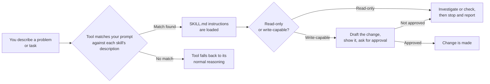
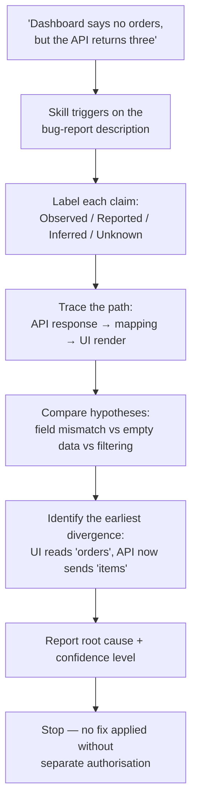

# AI Skills and Agents Samples

A **skill** is a Markdown file that teaches an AI coding assistant how to approach a specific kind of task — the same way a checklist or a runbook teaches a new hire — instead of you re-typing the same detailed instructions into a prompt every time. This repository is a learning collection of such skills, written once and reused across Codex, Claude Code, and GitHub Copilot CLI without changes.

## Quick start

```bash
git clone https://github.com/khadir-syed/ai-agent-skills.git && cd ai-agent-skills
./install.sh root-cause-investigator
```

Then, in Codex, Claude Code, or Copilot CLI, try the first prompt from [Try the samples](#try-the-samples) below.

## Contents

- [About this collection](#about-this-collection)
- [How a skill actually works](#how-a-skill-actually-works)
- [The three skills](#the-three-skills)
- [See it in action](#see-it-in-action)
- [Repository structure](#repository-structure)
- [Use a skill in an AI coding tool](#use-a-skill-in-an-ai-coding-tool)
- [Try the samples](#try-the-samples)
- [Troubleshooting](#troubleshooting)
- [What these samples do not provide](#what-these-samples-do-not-provide)
- [Customise them](#customise-them)
- [Official documentation](#official-documentation)

## About this collection

The collection is being developed progressively:

1. Skills
2. Agents
3. Orchestrators and multiple agents

Stage 1 (Skills) ships three samples, deliberately different in shape — read-only, write-capable, and multi-step — so the "one skill, many tools" claim is proven by repetition rather than a single example. Stage 1 reached its initial target of three skills; more skills are still welcome through contributions (see [CONTRIBUTING.md](CONTRIBUTING.md)). Stages 2 and 3 (agents, then orchestration) have not started.

## How a skill actually works

Every skill in this repo follows the same shape underneath: the tool matches your prompt against the skill's frontmatter `description`, loads its instructions, and the skill itself decides whether it can just report back or needs your approval first.



Here's that same flow traced through a real skill — [Root Cause Investigator](skills/root-cause-investigator/SKILL.md) — end to end:



## The three skills

| Skill | Shape | What it does |
|---|---|---|
| [Root Cause Investigator](skills/root-cause-investigator/SKILL.md) | Read-only, single-pass | Investigates a defect using labelled evidence (observed/reported/inferred/unknown) and stops before remediation. |
| [Changelog Entry Drafter](skills/changelog-entry-drafter/SKILL.md) | Write-capable, bounded to one file | Drafts a dated `CHANGELOG.md` entry from commits or a diff, shows it before writing, and writes only with explicit approval (one-time by default, session-scoped only if the user grants that in their own words). |
| [Pre-Merge Readiness Checklist](skills/pre-merge-readiness-checklist/SKILL.md) | Read-only, multi-step chain | Runs six fixed checks (tests, docs, debug leftovers, commit convention, secrets, sensitive files) and reports pass/fail/could-not-determine per check — never a false "ready." |

All three are instruction-only Markdown. None contain scripts, dependencies, credentials, or automatic tool permissions — enforcement of what they're allowed to do comes from the host tool's own permission model, not from the skill file itself.

## See it in action

A sample run of the Root Cause Investigator in a CLI session, using the synthetic scenario bundled with the skill:

```text
$ claude
> Use the Root Cause Investigator. The dashboard says there are no
> orders, but the API appears to return three.

Investigation status: Probable        Confidence: Medium

Reported: the API response contains 3 items under an `items` property.
Reported: the UI renders one row per entry in a property named `orders`;
          when that collection is empty, it shows "No orders found."
Reported: the API response contract changed last week from `orders`
          to `items`, with no corresponding UI change on record.

Causal chain:
  API contract changed (orders -> items)
    -> UI still reads `orders`
    -> UI evaluates a missing/empty collection
    -> renders "No orders found" despite 3 records existing

Root cause: an uncoordinated response-contract change. The API now
supplies records under `items`; the UI still reads `orders`.

Rejected/weakened alternatives: request failure and empty backend data
are both weakened by the reported successful 3-item response.

Validation limits: no source file or live runtime was inspected in
this session — the conclusion rests on the supplied description only.

Recommended next check — not performed: inspect the UI's response
mapping and confirm which property it reads. Not changed without
separate authorisation.
```

Notice what it does *not* do: no file was edited, no fix was proposed as fact, and every claim is traceable back to something reported or observed. That discipline — stop, label your evidence, don't guess — is the throughline across all three skills, just applied differently depending on whether the skill is read-only or write-capable.

## Repository structure

```text
skills/
├── root-cause-investigator/
│   ├── SKILL.md
│   ├── examples/
│   │   └── ui-api-field-mismatch.md
│   └── references/
│       └── investigation-report.md
├── changelog-entry-drafter/
│   ├── SKILL.md
│   ├── examples/
│   │   └── version-bump-example.md
│   └── references/
│       └── changelog-entry-format.md
└── pre-merge-readiness-checklist/
    ├── SKILL.md
    ├── examples/
    │   └── missing-tests-example.md
    └── references/
        └── checklist-report-format.md
install.sh
```

Each `SKILL.md` is the reusable instruction entry point for that skill. Each reference file holds a report/output format for substantial cases; each synthetic example demonstrates the expected reasoning without requiring a real application.

## Use a skill in an AI coding tool

Copy the complete skill directory, including its supporting files, into a skill location recognised by your tool — either by hand, or with `install.sh` (see below).

| Tool | Project location | Personal location | Example invocation |
|---|---|---|---|
| Codex | `.agents/skills/<skill-name>/` | `~/.agents/skills/<skill-name>/` | `$<skill-name> investigate why the customer list is empty` |
| Claude Code | `.claude/skills/<skill-name>/` | `~/.claude/skills/<skill-name>/` | `/<skill-name> investigate why the customer list is empty` |
| GitHub Copilot CLI | `.github/skills/<skill-name>/`, `.agents/skills/<skill-name>/`, or `.claude/skills/<skill-name>/` | `~/.copilot/skills/<skill-name>/` or `~/.agents/skills/<skill-name>/` | `/<skill-name> investigate why the customer list is empty` |

Restart or reload the relevant tool if it does not detect a newly copied skill. Invocation syntax and discovery behaviour can change between product versions, so consult the current product documentation when adopting the sample.

### CLI apps vs. desktop apps

The table above covers the **CLI tools** (Codex CLI, Claude Code CLI/IDE, Copilot CLI) and the standalone **Codex desktop app** — all of them read a skill directly from a project folder, so copying the folder (by hand or with `install.sh`) is enough.

The **Claude desktop/web app is different**: it does not read a project folder at all. It keeps a separate, global skill list that you populate by uploading a ZIP:

1. **Settings → Capabilities** → enable "Code execution and file creation" (a skill will not run without this).
2. **Customize → Skills** → **+** → **Create skill** → **Upload a skill**.
3. Select a ZIP of the skill folder with `SKILL.md` at the ZIP's root — not nested inside another folder, which is the most common upload failure.
4. Toggle the skill **on** after uploading — uploaded is not the same as enabled.

### Using the install script

`install.sh` is repo tooling, not part of any skill — the skills themselves stay Markdown-only; this script just automates the copy step above. It copies a skill into whichever tool directories already exist on disk. It does not detect which tools are installed beyond that, make network calls, or delete anything.

```bash
./install.sh root-cause-investigator
```

Copies into project-level directories only (`.agents/skills/`, `.claude/skills/`, `.github/skills/`) — whichever already exist in the current project. Pass `--global` to also copy into the personal (home) directories:

```bash
./install.sh --global changelog-entry-drafter
```

## Try the samples

Start with the synthetic case for each skill, then try prompts such as:

**Root Cause Investigator** — [ui-api-field-mismatch.md](skills/root-cause-investigator/examples/ui-api-field-mismatch.md)
- `Use the Root Cause Investigator. The dashboard says there are no orders, but the API appears to return three.`
- `Find out why the development environment works but staging returns 403. Stop before fixing it.`

**Changelog Entry Drafter** — [version-bump-example.md](skills/changelog-entry-drafter/examples/version-bump-example.md)
- `Use the Changelog Entry Drafter to draft a CHANGELOG.md entry from the commits since the last tag.`

**Pre-Merge Readiness Checklist** — [missing-tests-example.md](skills/pre-merge-readiness-checklist/examples/missing-tests-example.md)
- `Run the Pre-Merge Readiness Checklist on my current branch diff against main.`

A good result should identify what was observed, show the evidence behind the conclusion, and — for the two read-only skills — avoid making changes; for the Changelog Entry Drafter, it should show the draft and get explicit approval before writing.

None should activate for a request that's really remediation of an already-known defect, such as `Implement the already-approved change from orders to items`.

## Troubleshooting

Real friction encountered while building and testing this repo — not hypothetical.

**A skill doesn't show up in the slash-command / `@`-mention menu.**
Skills are discovered at session start, not live. Restart or reload the tool after copying a new skill in. Also confirm you copied the *whole* folder (`SKILL.md` plus `examples/` and `references/`), not just the `SKILL.md` file on its own.

**A skill doesn't trigger from a plain-language prompt, only when named explicitly.**
That's the tool's own matching against the skill's frontmatter `description` falling short, not a broken skill. Try invoking it explicitly first (`/skill-name` or `@skill-name`) to confirm discovery works at all, then tighten the `description` to name the situations it should catch.

**`install.sh` printed "Nothing copied."**
It only copies into tool directories that already exist (`.agents/`, `.claude/`, `.github/`) in your current project — it won't create them from scratch. Create one yourself first (e.g. `mkdir .claude`) or pass `--global` to target your home directory instead.

**Claude Desktop doesn't see a skill that works fine in Claude Code.**
Expected — they use two different mechanisms. Claude Code reads a project folder's `.claude/skills/` directly; Claude Desktop needs the skill uploaded as a ZIP through Settings, with Code execution enabled (see [CLI apps vs. desktop apps](#cli-apps-vs-desktop-apps) above).

**A write-capable skill wrote a file without asking again on a later run.**
Check whether an earlier prompt granted session-scoped approval without you noticing (e.g. "yes, and don't ask me again"). If you never granted that, treat it as a bug in the skill's approval wording — it should default to asking every single time, not assume standing permission from one "yes."

**GitHub shows a different commit author name/email than what's in your local git config.**
If the commit's email matches a verified email on a GitHub account (this includes `@users.noreply.github.com` addresses), GitHub displays that account's username and avatar instead of the raw name string stored in the commit. This is standard GitHub behaviour, not a caching bug or a sign the push failed — `git log` on the actual commit will still show whatever name you configured.

## What these samples do not provide

- They do not guarantee that an AI tool will select a skill automatically.
- They do not provide access to files, terminals, logs, databases, or external services.
- They do not override the tool's permission model or the user's instructions.
- They do not make a diagnosis, draft, or check correct merely because the response follows the expected format.
- They are learning samples, not a production incident-response, release, or security-control system.

## Customise them

Fork or copy a sample and change one concern at a time:

1. Refine the frontmatter description for the problems that should trigger it.
2. Add domain-specific paths to trace, such as browser to API to database.
3. Add evidence sources available in your environment.
4. Adjust the report template without weakening evidence and uncertainty requirements.
5. Test it with a known defect and at least one prompt that should not activate it.

Keep permissions separate from instructions. Declaring that a skill is read-only describes intended behaviour; the host tool's sandbox and approval controls remain the actual enforcement boundary.

## Official documentation

- [OpenAI: Build skills for ChatGPT and Codex](https://learn.chatgpt.com/docs/build-skills)
- [Anthropic: Extend Claude with skills](https://code.claude.com/docs/en/slash-commands)
- [GitHub: Add agent skills for GitHub Copilot CLI](https://docs.github.com/en/copilot/how-tos/copilot-cli/customize-copilot/add-skills)
