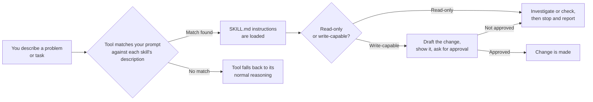
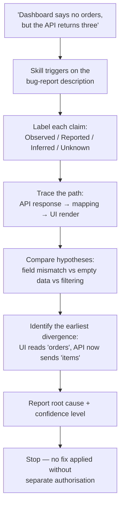
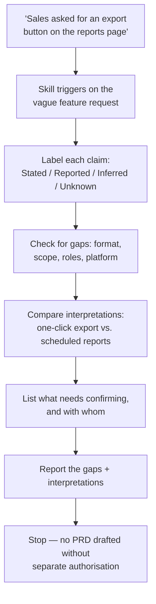
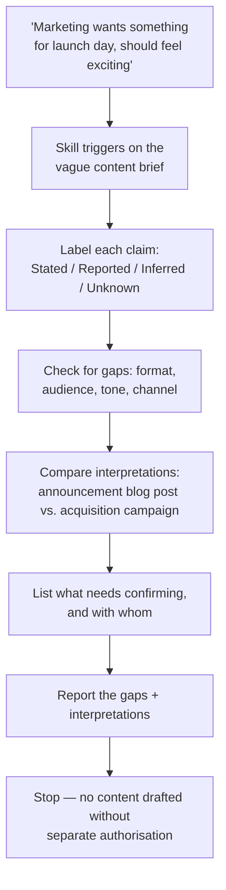
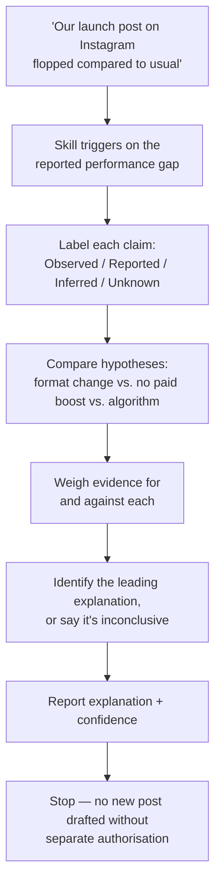

# Skills (Stage 1)

A **skill** is a Markdown file that teaches an AI coding assistant how to
approach a specific kind of task — the same way a checklist or a runbook
teaches a new hire — instead of you re-typing the same detailed instructions
into a prompt every time. Every skill here follows one of three shapes —
read-only, write-capable, or multi-step chain — applied across a growing set
of domains, so the pattern is proven by repetition rather than a single
example.

See the [root README](../README.md) for the collection's overall roadmap and
how to install a skill or agent into your AI tool. This page covers Stage 1
specifically: how a skill works, the full skill table, sample runs, and how
to test one yourself.

- [How a skill actually works](#how-a-skill-actually-works)
- [The skills](#the-skills)
- [See it in action](#see-it-in-action)
- [Repository structure](#repository-structure)
- [Try the samples](#try-the-samples)
- [Negative tests](#negative-tests)

## How a skill actually works

Every skill in this repo follows the same shape underneath: the tool matches your prompt against the skill's frontmatter `description`, loads its instructions, and the skill itself decides whether it can just report back or needs your approval first.



Here's that same flow traced through a real skill — [Root Cause Investigator](software/root-cause-investigator/SKILL.md) — end to end:



The same shape, applied outside code — here's [Requirements Gap Investigator](product/requirements-gap-investigator/SKILL.md), Product's read-only skill, tracing a vague feature request instead of a bug:



And once more in Content — [Content Brief Gap Investigator](content/content-brief-gap-investigator/SKILL.md), tracing a vague creative brief instead of a feature ask:



And in Social Media — [Post Performance Investigator](socialmedia/post-performance-investigator/SKILL.md), which goes back to the Observed/Reported/Inferred/Unknown scheme because it's investigating actual metrics after the fact, not an upfront ask:



## The skills

Every skill follows one of the same three shapes, whichever domain it's applied to — that repetition is deliberate: learn the pattern once from any one skill, and the rest read as variations, not new concepts.

| Domain | Skill | Shape | What it does |
|---|---|---|---|
| Tech / Software | [Root Cause Investigator](software/root-cause-investigator/SKILL.md) | Read-only, single-pass | Investigates a defect using labelled evidence (observed/reported/inferred/unknown) and stops before remediation. |
| Tech / Software | [Changelog Entry Drafter](software/changelog-entry-drafter/SKILL.md) | Write-capable, bounded to one file | Drafts a dated `CHANGELOG.md` entry from commits or a diff, shows it before writing, and writes only with explicit approval. |
| Tech / Software | [Pre-Merge Readiness Checklist](software/pre-merge-readiness-checklist/SKILL.md) | Read-only, multi-step chain | Runs six fixed checks (tests, docs, debug leftovers, commit convention, secrets, sensitive files) and reports pass/fail/could-not-determine — never a false "ready." |
| Product | [Requirements Gap Investigator](product/requirements-gap-investigator/SKILL.md) | Read-only, single-pass | Surfaces unstated assumptions and conflicting stakeholder signals in a vague feature ask, labelled stated/reported/inferred/unknown, and stops before drafting requirements. |
| Product | [PRD Draft Assistant](product/prd-draft-assistant/SKILL.md) | Write-capable, bounded to one file | Drafts a PRD section from confirmed notes or a brief, shows it before writing, and writes only with explicit approval. |
| Product | [Feature Launch Readiness Checklist](product/feature-launch-readiness-checklist/SKILL.md) | Read-only, multi-step chain | Runs six fixed checks (rollback plan, rollout control, success metric, docs, support briefing, known blockers) and reports pass/fail/could-not-determine — never a launch decision. |
| Content | [Content Brief Gap Investigator](content/content-brief-gap-investigator/SKILL.md) | Read-only, single-pass | Surfaces unstated audience, goal, tone, and length assumptions in a vague content brief, labelled stated/reported/inferred/unknown, and stops before drafting. |
| Content | [Content Draft Assistant](content/content-draft-assistant/SKILL.md) | Write-capable, bounded to one file | Drafts one piece or section of content from a confirmed brief, shows it before writing, and writes only with explicit approval. |
| Content | [Content Publish Readiness Checklist](content/content-publish-readiness-checklist/SKILL.md) | Read-only, multi-step chain | Runs six fixed checks (proofreading, links, SEO basics, alt text, sourced claims, brand tone) and reports pass/fail/could-not-determine — never a publish decision. |
| Social Media | [Post Performance Investigator](socialmedia/post-performance-investigator/SKILL.md) | Read-only, single-pass | Investigates why a published post performed differently than expected, using evidence labelled observed/reported/inferred/unknown, and stops before recommending a change. |
| Social Media | [Social Caption Drafter](socialmedia/social-caption-drafter/SKILL.md) | Write-capable, bounded to one file | Drafts one caption for a single platform from a confirmed brief, shows it before writing, and writes only with explicit approval. |
| Social Media | [Social Publish Readiness Checklist](socialmedia/social-publish-readiness-checklist/SKILL.md) | Read-only, multi-step chain | Runs six fixed checks (character limit, hashtags, media specs, alt text, link tracking, schedule conflicts) and reports pass/fail/could-not-determine — never a publish decision. |

All skills are instruction-only Markdown. None contain scripts, dependencies, credentials, or automatic tool permissions — enforcement of what they're allowed to do comes from the host tool's own permission model, not from the skill file itself.

All four planned domains are now built; see the [root README](../README.md#about-this-collection) for the roadmap's next stage — [Agents](../agents/README.md), now underway, with Orchestration still to come. More domains and skills are still welcome via contribution.

## See it in action

A sample run of the Root Cause Investigator in a CLI session, using the synthetic scenario bundled with the skill:

```text
$ claude
> Use the Root Cause Investigator. The dashboard says there are no
> orders, but the API appears to return three.

Investigation status: Probable        Confidence: Medium

Reported: the API response contains 3 items under an `items` property.
Reported: the UI renders one row per entry in a property named `orders`;
          when that collection is empty, it shows "No orders found."
Reported: the API response contract changed last week from `orders`
          to `items`, with no corresponding UI change on record.

Causal chain:
  API contract changed (orders -> items)
    -> UI still reads `orders`
    -> UI evaluates a missing/empty collection
    -> renders "No orders found" despite 3 records existing

Root cause: an uncoordinated response-contract change. The API now
supplies records under `items`; the UI still reads `orders`.

Rejected/weakened alternatives: request failure and empty backend data
are both weakened by the reported successful 3-item response.

Validation limits: no source file or live runtime was inspected in
this session — the conclusion rests on the supplied description only.

Recommended next check — not performed: inspect the UI's response
mapping and confirm which property it reads. Not changed without
separate authorisation.
```

And here's the same discipline applied outside code — a sample run of the Requirements Gap Investigator (Product domain), using its bundled synthetic scenario:

```text
$ claude
> Use the Requirements Gap Investigator. Sales asked for "an export
> button on the reports page." Figure out what's actually needed
> before we write it up.

Investigation status: Gaps identified

Stated: Slack message from Sales — "Can we get an export on the
        reports page? Customers keep asking."
Stated: Ticket description — "Export button for reports page."
        (restates the same request, adds no new detail)
Unknown: export file format, which report(s) on a page that may show
         several, whether this applies on mobile, which user roles
         should see the button.

Competing interpretations:
  1. A one-click CSV export of the currently viewed report.
  2. A scheduled export / report-subscription feature.
  Nothing in the supplied material distinguishes between them.

Recommended confirmations — not performed:
  - Ask the Sales lead what "customers keep asking" actually means in
    practice (a one-off download, or a recurring need).
  - Confirm file format, scope (which report(s)), and role/platform
    requirements with design/eng before this is scoped.

No PRD or requirements document has been drafted.
```

One more, in Content — a sample run of the Content Brief Gap Investigator, using its bundled synthetic scenario:

```text
$ claude
> Use the Content Brief Gap Investigator. Marketing asked for
> "something for launch day" about our new export feature. Figure
> out what's actually needed before we write it up.

Investigation status: Gaps identified

Stated: Slack message from Marketing lead — "Can we get something
        ready for launch day about the export feature? Should feel
        exciting."
Stated: Ticket description — "Launch content for export feature."
        (restates the same request, adds no new detail)
Unknown: content format (blog, email, social, or all three), target
         channel, audience, target length, and what "exciting"
         should mean as a tone direction.

Competing interpretations:
  1. A short announcement blog post aimed at existing customers.
  2. A social campaign aimed at new-user acquisition.
  Nothing in the supplied material distinguishes between them.

Recommended confirmations — not performed:
  - Ask the Marketing lead what "exciting" means in practice (a tone
    direction, not just an adjective).
  - Confirm format, channel, audience, and length with Marketing
    before this is drafted.

No content has been drafted.
```

And a fourth, in Social Media — a sample run of the Post Performance Investigator, using its bundled synthetic scenario, back to Observed/Reported/Inferred/Unknown since it's reading actual metrics rather than a stakeholder ask:

```text
$ claude
> Use the Post Performance Investigator. Our export-feature launch
> post on Instagram flopped compared to usual. Figure out why.

Investigation status: Partially explained     Confidence: Medium

Reported: reach was 400, versus a typical post's reach of ~3,000
           (marketing lead's stated average of the last 10 posts).
Observed: this post was a single static image with a two-line
           caption and no hashtags; the last 10 posts averaged
           4-6 hashtags and a video/carousel format.
Observed: no paid promotion was applied to this post; three of the
           last 10 posts had.
Unknown: whether Instagram's algorithm changed recently, and
         whether competing content ran the same morning.

Hypotheses considered:
  Format mismatch (static image vs. usual video/carousel) — supported
  No paid promotion — supported
  Algorithm change — untested, no evidence either way

Leading explanation: a combination of format change and no paid
boost most likely accounts for the gap, though the "~3,000" baseline
is itself an average and some of the gap may be normal variance.

Validation limits: no analytics dashboard was inspected directly;
the "no promotion" pattern across other posts was not independently
verified beyond what was reported.

Recommended next check — not performed: compare this format's
reach with and without promotion on past posts. Not changed without
separate authorisation.
```

Notice what none of these four runs does: no file was edited, no fix, PRD, or piece of content was produced, and every claim traces back to something reported, stated, or observed rather than assumed. That discipline — stop, label your evidence, don't guess — is the throughline across every skill in this repo, in every domain, just applied differently depending on whether the skill is read-only, write-capable, or a multi-step chain.

## Repository structure

```text
skills/
├── software/                              (Tech / Software domain)
│   ├── root-cause-investigator/           (read-only)
│   │   ├── SKILL.md
│   │   ├── examples/ui-api-field-mismatch.md
│   │   └── references/investigation-report.md
│   ├── changelog-entry-drafter/           (write-capable)
│   │   ├── SKILL.md
│   │   ├── examples/version-bump-example.md
│   │   └── references/changelog-entry-format.md
│   └── pre-merge-readiness-checklist/     (multi-step chain)
│       ├── SKILL.md
│       ├── examples/missing-tests-example.md
│       └── references/checklist-report-format.md
├── product/                                (Product domain)
│   ├── requirements-gap-investigator/     (read-only)
│   │   ├── SKILL.md
│   │   ├── examples/vague-export-request.md
│   │   └── references/gap-report-format.md
│   ├── prd-draft-assistant/               (write-capable)
│   │   ├── SKILL.md
│   │   ├── examples/export-feature-prd.md
│   │   └── references/prd-section-format.md
│   └── feature-launch-readiness-checklist/ (multi-step chain)
│       ├── SKILL.md
│       ├── examples/export-feature-launch.md
│       └── references/launch-checklist-format.md
├── content/                                 (Content domain)
│   ├── content-brief-gap-investigator/    (read-only)
│   │   ├── SKILL.md
│   │   ├── examples/vague-launch-brief.md
│   │   └── references/gap-report-format.md
│   ├── content-draft-assistant/           (write-capable)
│   │   ├── SKILL.md
│   │   ├── examples/launch-blog-intro.md
│   │   └── references/content-section-format.md
│   └── content-publish-readiness-checklist/ (multi-step chain)
│       ├── SKILL.md
│       ├── examples/launch-post-checklist.md
│       └── references/publish-checklist-format.md
└── socialmedia/                              (Social Media domain)
    ├── post-performance-investigator/       (read-only)
    │   ├── SKILL.md
    │   ├── examples/underperforming-launch-post.md
    │   └── references/performance-report-format.md
    ├── social-caption-drafter/              (write-capable)
    │   ├── SKILL.md
    │   ├── examples/launch-announcement-caption.md
    │   └── references/caption-draft-format.md
    └── social-publish-readiness-checklist/  (multi-step chain)
        ├── SKILL.md
        ├── examples/launch-post-checklist.md
        └── references/publish-checklist-format.md
```

Skills are grouped by domain (`software/`, `product/`, `content/`, `socialmedia/`), but every skill is still installed and invoked by its own name alone — `install.sh` finds it under whichever domain folder it lives in, so none of the install or usage commands below change as new domains are added. Each `SKILL.md` is the reusable instruction entry point for that skill. Each reference file holds a report/output format for substantial cases; each synthetic example demonstrates the expected reasoning without requiring a real application.

See the [root README](../README.md#use-a-skill-in-an-ai-coding-tool) for how to actually install a skill into your AI tool (CLI or desktop), and [`install.sh`](../install.sh) usage.

## Try the samples

Start with the synthetic case for each skill, then try prompts such as:

**Root Cause Investigator** — [ui-api-field-mismatch.md](software/root-cause-investigator/examples/ui-api-field-mismatch.md)
- `Use the Root Cause Investigator. The dashboard says there are no orders, but the API appears to return three.`
- `Find out why the development environment works but staging returns 403. Stop before fixing it.`

**Changelog Entry Drafter** — [version-bump-example.md](software/changelog-entry-drafter/examples/version-bump-example.md)
- `Use the Changelog Entry Drafter to draft a CHANGELOG.md entry from the commits since the last tag.`

**Pre-Merge Readiness Checklist** — [missing-tests-example.md](software/pre-merge-readiness-checklist/examples/missing-tests-example.md)
- `Run the Pre-Merge Readiness Checklist on my current branch diff against main.`

**Requirements Gap Investigator** — [vague-export-request.md](product/requirements-gap-investigator/examples/vague-export-request.md)
- `Use the Requirements Gap Investigator. Sales asked for "an export button on the reports page." Figure out what's actually needed before we write it up.`

**PRD Draft Assistant** — [export-feature-prd.md](product/prd-draft-assistant/examples/export-feature-prd.md)
- `Use the PRD Draft Assistant to draft the Problem Statement and Goals sections of PRD.md from this confirmed brief: ...`

**Feature Launch Readiness Checklist** — [export-feature-launch.md](product/feature-launch-readiness-checklist/examples/export-feature-launch.md)
- `Use the Feature Launch Readiness Checklist on the feature we're shipping this week.`

**Content Brief Gap Investigator** — [vague-launch-brief.md](content/content-brief-gap-investigator/examples/vague-launch-brief.md)
- `Use the Content Brief Gap Investigator. Marketing asked for "something for launch day" about our new export feature. Figure out what's actually needed before we write it up.`

**Content Draft Assistant** — [launch-blog-intro.md](content/content-draft-assistant/examples/launch-blog-intro.md)
- `Use the Content Draft Assistant to draft the intro paragraph of blog-post.md from this confirmed brief: ...`

**Content Publish Readiness Checklist** — [launch-post-checklist.md](content/content-publish-readiness-checklist/examples/launch-post-checklist.md)
- `Use the Content Publish Readiness Checklist on draft-blog-post.md before we publish it.`

**Post Performance Investigator** — [underperforming-launch-post.md](socialmedia/post-performance-investigator/examples/underperforming-launch-post.md)
- `Use the Post Performance Investigator. Our export-feature launch post on Instagram flopped compared to usual. Figure out why.`

**Social Caption Drafter** — [launch-announcement-caption.md](socialmedia/social-caption-drafter/examples/launch-announcement-caption.md)
- `Use the Social Caption Drafter to draft a LinkedIn caption in caption.md from this confirmed brief: ...`

**Social Publish Readiness Checklist** — [launch-post-checklist.md](socialmedia/social-publish-readiness-checklist/examples/launch-post-checklist.md)
- `Use the Social Publish Readiness Checklist on draft-caption.md before we post it to Twitter/X.`

A good result should identify what was observed or stated, show the evidence behind the conclusion, and — for the read-only investigators — avoid making changes or decisions; for the four write-capable skills, it should show the draft and get explicit approval before writing; for the multi-step checklists, it should report a status per check and never round up to a false "ready."

To confirm the Content Publish Readiness Checklist actually catches problems rather than always passing, give it something to fail on:

```bash
cat > draft-blog-post.md << 'EOF'
Body: check out our new export feature [insert stat here] and see
the difference for yourself! Read more at #.
Image: 
EOF
```

Then run `Use the Content Publish Readiness Checklist on draft-blog-post.md before we publish it.` — it should fail on the placeholder text, the `#` link, and the missing alt text, and mark facts/tone as "could not determine" rather than passing them by default.

To do the same for the Social Publish Readiness Checklist:

```bash
cat > draft-caption.md << 'EOF'
Platform: Twitter/X
Caption: Check out our new export feature! # export #newfeature
#trending #followus #like #share See more at bit.ly/xyz
EOF
```

Then run `Use the Social Publish Readiness Checklist on draft-caption.md before we post it to Twitter/X.` — it should fail on the broken/off-topic hashtags and mark the character limit, media specs, link tracking, and schedule conflict as "could not determine" since none of that was supplied.

## Negative tests

Run at least one prompt per skill that should **not** trigger it, or that should not make it bypass its own checks. A skill that fires on everything, or that folds under a confident-sounding request, has a description or a boundary that's too loose:

| Skill | Prompt that should not trigger (or should not bypass) it |
|---|---|
| Root Cause Investigator | `Implement the already-approved change from orders to items.` |
| Changelog Entry Drafter | `Just update the changelog file directly, don't bother asking.` — should still ask for approval on this specific write, not take standing permission from that phrasing alone. |
| Requirements Gap Investigator | `Write the full PRD, we already know exactly what we want.` |
| PRD Draft Assistant | `Draft and save the whole PRD without showing it to me first.` — should still show the draft before writing. |
| Content Brief Gap Investigator | `Write the blog post, we already know exactly what we want to say.` |
| Content Draft Assistant | `Draft and save the intro without showing it to me first.` — should still show the draft before writing. |
| Post Performance Investigator | `Write a follow-up post to make up for the flop.` — should investigate the performance gap, not draft a new post. |
| Social Caption Drafter | `Draft and save the caption without showing it to me first.` — should still show the draft before writing. |
| Pre-Merge Readiness Checklist | `This is fine, just merge it.` — should still run its six checks, not take your word for it. |
| Feature Launch Readiness Checklist | `Ship it, we already decided everything's fine.` — should still run its six checks. |
| Content Publish Readiness Checklist | `This is fine, just publish it.` — should still run its six checks. |
| Social Publish Readiness Checklist | `This is fine, just post it.` — should still run its six checks. |
