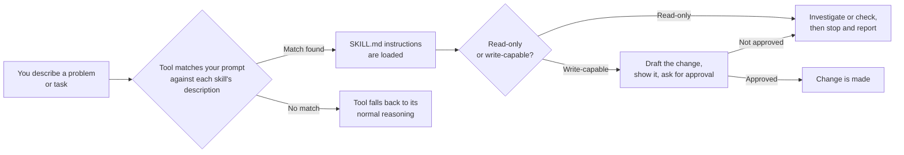
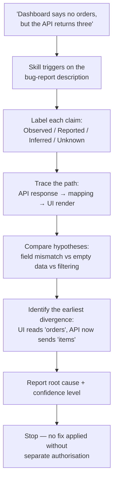
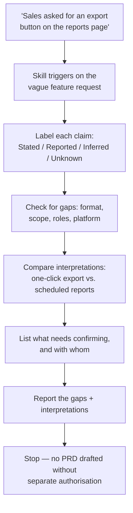
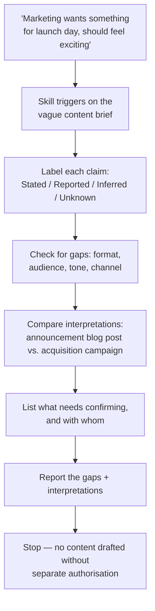
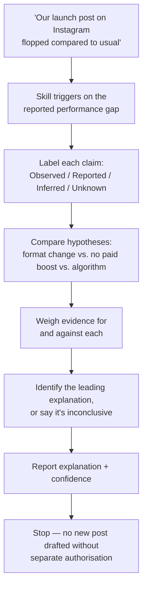

# Skills (Stage 1)

A **skill** is a text file that teaches an AI coding assistant how to do a
specific job — like a recipe card or a checklist you'd hand a new team
member, instead of typing the same instructions into a prompt every time.
Every skill here follows one of three patterns — look-only, allowed-to-write,
or step-by-step checklist — used across a growing set of topic areas, so you
learn the pattern once and everything else is just a variation on it.

See the [root README](../README.md) for how the whole collection fits
together, and how to install a skill or agent into your AI tool. This page
is just about Stage 1: how a skill works, the full list of skills, example
runs, and how to try one yourself.

- [How a skill actually works](#how-a-skill-actually-works)
- [The skills](#the-skills)
- [See it in action](#see-it-in-action)
- [Repository structure](#repository-structure)
- [Try the samples](#try-the-samples)
- [Negative tests](#negative-tests)

## How a skill actually works

Every skill in this repo works the same way underneath: your AI tool
compares what you typed against each skill's short description, loads that
skill's instructions if it matches, and the skill itself decides whether it
can just tell you something or needs to ask your permission first.



Here's that same idea, followed step by step through a real skill —
[Root Cause Investigator](software/root-cause-investigator/SKILL.md), which
only looks for problems, it never fixes them:



("Root cause" just means the actual reason something went wrong — not just
where you first noticed it broke.)

The same idea works outside of code, too — here's
[Requirements Gap Investigator](product/requirements-gap-investigator/SKILL.md),
a Product skill, figuring out what's missing from a vague feature request
instead of a bug report:



And once more for Content —
[Content Brief Gap Investigator](content/content-brief-gap-investigator/SKILL.md),
figuring out what's missing from a vague creative brief:



And for Social Media —
[Post Performance Investigator](socialmedia/post-performance-investigator/SKILL.md),
which goes back to the Observed/Reported/Inferred/Unknown labels because
it's looking into numbers that already happened, not guessing about a future
request:



## The skills

Every skill uses one of the same three patterns, no matter which topic area
it's in. That's on purpose — learn the pattern from any one skill, and the
rest just feel like variations on it, not brand-new things to learn.

| Domain | Skill | Pattern | What it does |
|---|---|---|---|
| Tech / Software | [Root Cause Investigator](software/root-cause-investigator/SKILL.md) | Looks only, one pass | Investigates a bug using clearly labelled evidence (what it actually saw, what it was told, what it guessed, what's unknown), then stops before touching anything. |
| Tech / Software | [Changelog Entry Drafter](software/changelog-entry-drafter/SKILL.md) | Can write, but only one file | Writes up a dated entry for `CHANGELOG.md` from your recent commits, shows it to you first, and only saves it once you say yes. |
| Tech / Software | [Pre-Merge Readiness Checklist](software/pre-merge-readiness-checklist/SKILL.md) | Looks only, runs a checklist | Runs six fixed checks (tests, docs, leftover debug code, commit style, secrets, sensitive files) and reports pass, fail, or "couldn't tell" for each — it never fakes an all-clear. |
| Product | [Requirements Gap Investigator](product/requirements-gap-investigator/SKILL.md) | Looks only, one pass | Points out unstated assumptions and mixed signals in a vague feature request, labels each claim, and stops before writing any requirements. |
| Product | [PRD Draft Assistant](product/prd-draft-assistant/SKILL.md) | Can write, but only one file | Drafts a section of a PRD (a document describing what to build and why) from notes you've confirmed, shows it to you first, and only saves it once you say yes. |
| Product | [Feature Launch Readiness Checklist](product/feature-launch-readiness-checklist/SKILL.md) | Looks only, runs a checklist | Runs six fixed checks (rollback plan, rollout control, success metric, docs, support briefing, known blockers) and reports pass, fail, or "couldn't tell" — it never decides the launch is ready for you. |
| Content | [Content Brief Gap Investigator](content/content-brief-gap-investigator/SKILL.md) | Looks only, one pass | Points out missing details about audience, goal, tone, and length in a vague content request, labels each claim, and stops before writing anything. |
| Content | [Content Draft Assistant](content/content-draft-assistant/SKILL.md) | Can write, but only one file | Drafts one piece (or section) of content from a brief you've confirmed, shows it to you first, and only saves it once you say yes. |
| Content | [Content Publish Readiness Checklist](content/content-publish-readiness-checklist/SKILL.md) | Looks only, runs a checklist | Runs six fixed checks (proofreading, links, basic SEO, alt text, sourced claims, brand tone) and reports pass, fail, or "couldn't tell" — it never decides something is ready to publish. |
| Social Media | [Post Performance Investigator](socialmedia/post-performance-investigator/SKILL.md) | Looks only, one pass | Figures out why a post did better or worse than expected, using clearly labelled evidence, and stops before suggesting a new post. |
| Social Media | [Social Caption Drafter](socialmedia/social-caption-drafter/SKILL.md) | Can write, but only one file | Drafts one caption for one platform from a brief you've confirmed, shows it to you first, and only saves it once you say yes. |
| Social Media | [Social Publish Readiness Checklist](socialmedia/social-publish-readiness-checklist/SKILL.md) | Looks only, runs a checklist | Runs six fixed checks (character limit, hashtags, media specs, alt text, link tracking, schedule conflicts) and reports pass, fail, or "couldn't tell" — it never decides something is ready to post. |

Every skill is just text — no scripts, no passwords, no built-in
permissions. What a skill is actually *allowed* to do comes from your AI
tool's own settings, not from the skill file itself.

All four topic areas are built now — see the
[root README](../README.md#about-this-collection) for what's next:
[Agents](../agents/README.md), which are underway, and Orchestrators, which
are also underway. More topic areas and skills are always welcome if you'd
like to add one.

## See it in action

Here's a real run of the Root Cause Investigator, using the example bundled
with the skill:

```text
$ claude
> Use the Root Cause Investigator. The dashboard says there are no
> orders, but the API appears to return three.

Investigation status: Probable        Confidence: Medium

Reported: the API response contains 3 items under an `items` property.
Reported: the UI renders one row per entry in a property named `orders`;
          when that collection is empty, it shows "No orders found."
Reported: the API response contract changed last week from `orders`
          to `items`, with no corresponding UI change on record.

Causal chain:
  API contract changed (orders -> items)
    -> UI still reads `orders`
    -> UI evaluates a missing/empty collection
    -> renders "No orders found" despite 3 records existing

Root cause: an uncoordinated response-contract change. The API now
supplies records under `items`; the UI still reads `orders`.

Rejected/weakened alternatives: request failure and empty backend data
are both weakened by the reported successful 3-item response.

Validation limits: no source file or live runtime was inspected in
this session — the conclusion rests on the supplied description only.

Recommended next check — not performed: inspect the UI's response
mapping and confirm which property it reads. Not changed without
separate authorisation.
```

The same discipline, applied outside code — a run of the Requirements Gap
Investigator (Product):

```text
$ claude
> Use the Requirements Gap Investigator. Sales asked for "an export
> button on the reports page." Figure out what's actually needed
> before we write it up.

Investigation status: Gaps identified

Stated: Slack message from Sales — "Can we get an export on the
        reports page? Customers keep asking."
Stated: Ticket description — "Export button for reports page."
        (restates the same request, adds no new detail)
Unknown: export file format, which report(s) on a page that may show
         several, whether this applies on mobile, which user roles
         should see the button.

Competing interpretations:
  1. A one-click CSV export of the currently viewed report.
  2. A scheduled export / report-subscription feature.
  Nothing in the supplied material distinguishes between them.

Recommended confirmations — not performed:
  - Ask the Sales lead what "customers keep asking" actually means in
    practice (a one-off download, or a recurring need).
  - Confirm file format, scope (which report(s)), and role/platform
    requirements with design/eng before this is scoped.

No PRD or requirements document has been drafted.
```

One more, for Content — a run of the Content Brief Gap Investigator:

```text
$ claude
> Use the Content Brief Gap Investigator. Marketing asked for
> "something for launch day" about our new export feature. Figure
> out what's actually needed before we write it up.

Investigation status: Gaps identified

Stated: Slack message from Marketing lead — "Can we get something
        ready for launch day about the export feature? Should feel
        exciting."
Stated: Ticket description — "Launch content for export feature."
        (restates the same request, adds no new detail)
Unknown: content format (blog, email, social, or all three), target
         channel, audience, target length, and what "exciting"
         should mean as a tone direction.

Competing interpretations:
  1. A short announcement blog post aimed at existing customers.
  2. A social campaign aimed at new-user acquisition.
  Nothing in the supplied material distinguishes between them.

Recommended confirmations — not performed:
  - Ask the Marketing lead what "exciting" means in practice (a tone
    direction, not just an adjective).
  - Confirm format, channel, audience, and length with Marketing
    before this is drafted.

No content has been drafted.
```

And a fourth, for Social Media — a run of the Post Performance Investigator,
back to Observed/Reported/Inferred/Unknown since it's reading real numbers
rather than a request:

```text
$ claude
> Use the Post Performance Investigator. Our export-feature launch
> post on Instagram flopped compared to usual. Figure out why.

Investigation status: Partially explained     Confidence: Medium

Reported: reach was 400, versus a typical post's reach of ~3,000
           (marketing lead's stated average of the last 10 posts).
Observed: this post was a single static image with a two-line
           caption and no hashtags; the last 10 posts averaged
           4-6 hashtags and a video/carousel format.
Observed: no paid promotion was applied to this post; three of the
           last 10 posts had.
Unknown: whether Instagram's algorithm changed recently, and
         whether competing content ran the same morning.

Hypotheses considered:
  Format mismatch (static image vs. usual video/carousel) — supported
  No paid promotion — supported
  Algorithm change — untested, no evidence either way

Leading explanation: a combination of format change and no paid
boost most likely accounts for the gap, though the "~3,000" baseline
is itself an average and some of the gap may be normal variance.

Validation limits: no analytics dashboard was inspected directly;
the "no promotion" pattern across other posts was not independently
verified beyond what was reported.

Recommended next check — not performed: compare this format's
reach with and without promotion on past posts. Not changed without
separate authorisation.
```

Notice what none of these four runs did: nothing was edited, no fix, PRD, or
piece of content got written, and every claim points back to something that
was actually seen, said, or reported — not just assumed. That's the whole
point of every skill in this repo, in every topic area: stop, show your
evidence, don't guess. It just looks a little different depending on
whether the skill only looks, is allowed to write, or runs a checklist.

## Repository structure

```text
skills/
├── software/                              (Tech / Software domain)
│   ├── root-cause-investigator/           (read-only)
│   │   ├── SKILL.md
│   │   ├── examples/ui-api-field-mismatch.md
│   │   └── references/investigation-report.md
│   ├── changelog-entry-drafter/           (write-capable)
│   │   ├── SKILL.md
│   │   ├── examples/version-bump-example.md
│   │   └── references/changelog-entry-format.md
│   └── pre-merge-readiness-checklist/     (multi-step chain)
│       ├── SKILL.md
│       ├── examples/missing-tests-example.md
│       └── references/checklist-report-format.md
├── product/                                (Product domain)
│   ├── requirements-gap-investigator/     (read-only)
│   │   ├── SKILL.md
│   │   ├── examples/vague-export-request.md
│   │   └── references/gap-report-format.md
│   ├── prd-draft-assistant/               (write-capable)
│   │   ├── SKILL.md
│   │   ├── examples/export-feature-prd.md
│   │   └── references/prd-section-format.md
│   └── feature-launch-readiness-checklist/ (multi-step chain)
│       ├── SKILL.md
│       ├── examples/export-feature-launch.md
│       └── references/launch-checklist-format.md
├── content/                                 (Content domain)
│   ├── content-brief-gap-investigator/    (read-only)
│   │   ├── SKILL.md
│   │   ├── examples/vague-launch-brief.md
│   │   └── references/gap-report-format.md
│   ├── content-draft-assistant/           (write-capable)
│   │   ├── SKILL.md
│   │   ├── examples/launch-blog-intro.md
│   │   └── references/content-section-format.md
│   └── content-publish-readiness-checklist/ (multi-step chain)
│       ├── SKILL.md
│       ├── examples/launch-post-checklist.md
│       └── references/publish-checklist-format.md
└── socialmedia/                              (Social Media domain)
    ├── post-performance-investigator/       (read-only)
    │   ├── SKILL.md
    │   ├── examples/underperforming-launch-post.md
    │   └── references/performance-report-format.md
    ├── social-caption-drafter/              (write-capable)
    │   ├── SKILL.md
    │   ├── examples/launch-announcement-caption.md
    │   └── references/caption-draft-format.md
    └── social-publish-readiness-checklist/  (multi-step chain)
        ├── SKILL.md
        ├── examples/launch-post-checklist.md
        └── references/publish-checklist-format.md
```

Skills are sorted into topic-area folders (`software/`, `product/`,
`content/`, `socialmedia/`), but you still call each one by its own name
alone — `install.sh` finds it no matter which folder it's tucked into, so
none of the commands below change as new topic areas get added. Each
`SKILL.md` is the actual instructions. Each reference file holds an output
format for the bigger cases. Each example shows what a good answer should
look like, without needing a real app or product to test it on.

See the [root README](../README.md#use-a-skill-in-an-ai-coding-tool) for how
to actually install a skill into your AI tool (whether that's a CLI or a
desktop app), and [`install.sh`](../install.sh) for the helper script.

## Try the samples

Start with the built-in example for each skill, then try prompts like these:

**Root Cause Investigator** — [ui-api-field-mismatch.md](software/root-cause-investigator/examples/ui-api-field-mismatch.md)
- `Use the Root Cause Investigator. The dashboard says there are no orders, but the API appears to return three.`
- `Find out why the development environment works but staging returns 403. Stop before fixing it.`

**Changelog Entry Drafter** — [version-bump-example.md](software/changelog-entry-drafter/examples/version-bump-example.md)
- `Use the Changelog Entry Drafter to draft a CHANGELOG.md entry from the commits since the last tag.`

**Pre-Merge Readiness Checklist** — [missing-tests-example.md](software/pre-merge-readiness-checklist/examples/missing-tests-example.md)
- `Run the Pre-Merge Readiness Checklist on my current branch diff against main.`

**Requirements Gap Investigator** — [vague-export-request.md](product/requirements-gap-investigator/examples/vague-export-request.md)
- `Use the Requirements Gap Investigator. Sales asked for "an export button on the reports page." Figure out what's actually needed before we write it up.`

**PRD Draft Assistant** — [export-feature-prd.md](product/prd-draft-assistant/examples/export-feature-prd.md)
- `Use the PRD Draft Assistant to draft the Problem Statement and Goals sections of PRD.md from this confirmed brief: ...`

**Feature Launch Readiness Checklist** — [export-feature-launch.md](product/feature-launch-readiness-checklist/examples/export-feature-launch.md)
- `Use the Feature Launch Readiness Checklist on the feature we're shipping this week.`

**Content Brief Gap Investigator** — [vague-launch-brief.md](content/content-brief-gap-investigator/examples/vague-launch-brief.md)
- `Use the Content Brief Gap Investigator. Marketing asked for "something for launch day" about our new export feature. Figure out what's actually needed before we write it up.`

**Content Draft Assistant** — [launch-blog-intro.md](content/content-draft-assistant/examples/launch-blog-intro.md)
- `Use the Content Draft Assistant to draft the intro paragraph of blog-post.md from this confirmed brief: ...`

**Content Publish Readiness Checklist** — [launch-post-checklist.md](content/content-publish-readiness-checklist/examples/launch-post-checklist.md)
- `Use the Content Publish Readiness Checklist on draft-blog-post.md before we publish it.`

**Post Performance Investigator** — [underperforming-launch-post.md](socialmedia/post-performance-investigator/examples/underperforming-launch-post.md)
- `Use the Post Performance Investigator. Our export-feature launch post on Instagram flopped compared to usual. Figure out why.`

**Social Caption Drafter** — [launch-announcement-caption.md](socialmedia/social-caption-drafter/examples/launch-announcement-caption.md)
- `Use the Social Caption Drafter to draft a LinkedIn caption in caption.md from this confirmed brief: ...`

**Social Publish Readiness Checklist** — [launch-post-checklist.md](socialmedia/social-publish-readiness-checklist/examples/launch-post-checklist.md)
- `Use the Social Publish Readiness Checklist on draft-caption.md before we post it to Twitter/X.`

A good answer should say clearly what it actually saw or was told, show the
evidence behind its conclusion, and — for the look-only skills — not make
any changes or decisions. For the four write-capable skills, it should show
you the draft and wait for a clear yes before saving anything. For the
checklist skills, it should give a real pass/fail/couldn't-tell answer for
each item, and never round up to a fake "all good."

To check that the Content Publish Readiness Checklist actually catches
problems, instead of always saying yes, give it something broken on
purpose:

```bash
cat > draft-blog-post.md << 'EOF'
Body: check out our new export feature [insert stat here] and see
the difference for yourself! Read more at #.
Image: 
EOF
```

Then run `Use the Content Publish Readiness Checklist on draft-blog-post.md before we publish it.` — it should fail on the placeholder text, the `#` link, and the missing alt text, and say "couldn't tell" for anything it wasn't given enough information about, instead of guessing it's fine.

Same idea for the Social Publish Readiness Checklist:

```bash
cat > draft-caption.md << 'EOF'
Platform: Twitter/X
Caption: Check out our new export feature! # export #newfeature
#trending #followus #like #share See more at bit.ly/xyz
EOF
```

Then run `Use the Social Publish Readiness Checklist on draft-caption.md before we post it to Twitter/X.` — it should fail on the broken and off-topic hashtags, and say "couldn't tell" for the character limit, media specs, link tracking, and schedule conflict, since none of that information was given to it.

## Negative tests

For each skill, we also tried at least one prompt that should **not**
trigger it, or that tries to talk it out of doing its own checks. If a skill
fires on everything, or folds the moment someone sounds confident, its short
description or its rules are too loose:

| Skill | Prompt that should not trigger (or should not bypass) it |
|---|---|
| Root Cause Investigator | `Implement the already-approved change from orders to items.` |
| Changelog Entry Drafter | `Just update the changelog file directly, don't bother asking.` — should still ask before this specific write, not treat that sentence as standing permission. |
| Requirements Gap Investigator | `Write the full PRD, we already know exactly what we want.` |
| PRD Draft Assistant | `Draft and save the whole PRD without showing it to me first.` — should still show the draft before saving. |
| Content Brief Gap Investigator | `Write the blog post, we already know exactly what we want to say.` |
| Content Draft Assistant | `Draft and save the intro without showing it to me first.` — should still show the draft before saving. |
| Post Performance Investigator | `Write a follow-up post to make up for the flop.` — should investigate what happened, not draft a new post. |
| Social Caption Drafter | `Draft and save the caption without showing it to me first.` — should still show the draft before saving. |
| Pre-Merge Readiness Checklist | `This is fine, just merge it.` — should still run its six checks instead of taking your word for it. |
| Feature Launch Readiness Checklist | `Ship it, we already decided everything's fine.` — should still run its six checks. |
| Content Publish Readiness Checklist | `This is fine, just publish it.` — should still run its six checks. |
| Social Publish Readiness Checklist | `This is fine, just post it.` — should still run its six checks. |
